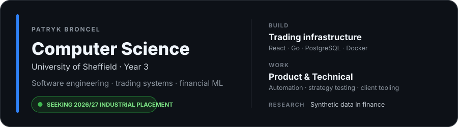
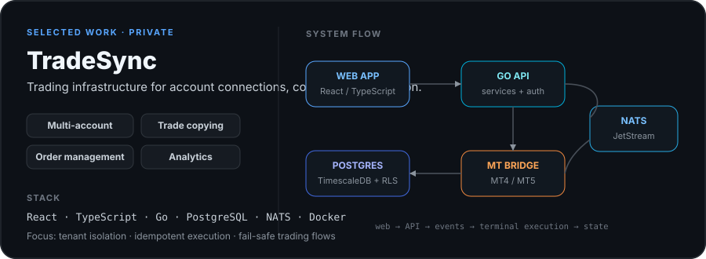

<picture>
  <source media="(prefers-color-scheme: dark)" srcset="./assets/hero-dark.svg">
  <source media="(prefers-color-scheme: light)" srcset="./assets/hero-light.svg">
  
</picture>

  <a href="https://linkedin.com/in/patrykbr"><strong>LinkedIn</strong></a>
  &nbsp;&nbsp;·&nbsp;&nbsp;
  <a href="mailto:patbroncel@gmail.com"><strong>Email</strong></a>
  &nbsp;&nbsp;·&nbsp;&nbsp;
  <a href="https://github.com/PatrykBr/Tradingview-Optimiser"><strong>Featured project ↗</strong></a>

  &nbsp;&nbsp;
  &nbsp;&nbsp;
  &nbsp;&nbsp;
  &nbsp;&nbsp;
  &nbsp;&nbsp;
  &nbsp;&nbsp;
  &nbsp;&nbsp;
  &nbsp;&nbsp;
  

## At a glance

<table width="100%">
<tr>
<td width="33%" valign="top">

**Experience**  
Product & Technical Associate  
TradeAlgorithm

</td>
<td width="33%" valign="top">

**Research**  
Synthetic data in finance  
Third-year dissertation

</td>
<td width="33%" valign="top">

**Looking for**  
2026/27 industrial placement  
Software engineering / fintech

</td>
</tr>
</table>

## Selected work

<table width="100%">
<tr>
<td width="58%" valign="middle">

### TradeSync

**Trading infrastructure for connecting accounts, copying trades and managing execution.**

`React` · `TypeScript` · `Go` · `PostgreSQL` · `NATS` · `Docker`

**Built around:** multi-account connections · trade copying · order management · analytics

Private project

</td>
<td width="42%" valign="middle">

<picture>
  <source media="(prefers-color-scheme: dark)" srcset="./assets/tradesync-dark.svg">
  <source media="(prefers-color-scheme: light)" srcset="./assets/tradesync-light.svg">
  
</picture>

</td>
</tr>

<tr>
<td width="42%" valign="middle">

</td>
<td width="58%" valign="middle">

### [TradingView Optimiser ↗](https://github.com/PatrykBr/Tradingview-Optimiser)

**Browser extension that optimises TradingView strategy parameters with a local Python backend.**

`React` · `TypeScript` · `FastAPI` · `WebSockets` · `Optuna`

**Includes:** Bayesian optimisation · walk-forward analysis · Monte Carlo testing

</td>
</tr>
</table>

## Also built

[**cTrader Webhook**](https://github.com/PatrykBr/cTrader-Webhook) · [**Zed StyLua**](https://github.com/PatrykBr/zed-stylua) · [**Zed Selene**](https://github.com/PatrykBr/zed-selene) · [**ShortForm Creator**](https://github.com/PatrykBr/ShortForm-Creator)
