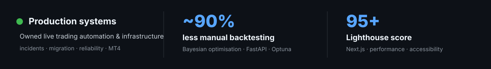
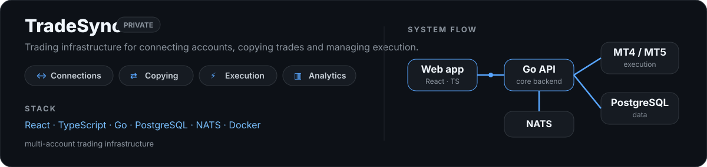

# Patryk Broncel

**Computer Science @ University of Sheffield**  
Full-stack software engineering · trading systems · ML & data

  

  

&nbsp;&nbsp;
&nbsp;&nbsp;
&nbsp;&nbsp;
&nbsp;&nbsp;
&nbsp;&nbsp;
&nbsp;&nbsp;
&nbsp;&nbsp;
&nbsp;&nbsp;

 

<picture>
  <source media="(prefers-color-scheme: dark)" srcset="./assets/highlights-v3-dark.svg">
  <source media="(prefers-color-scheme: light)" srcset="./assets/highlights-v3-light.svg">
  
</picture>

## Selected work

<picture>
  <source media="(prefers-color-scheme: dark)" srcset="./assets/tradesync-v3-dark.svg">
  <source media="(prefers-color-scheme: light)" srcset="./assets/tradesync-v3-light.svg">
  
</picture>

### [TradingView Strategy Optimiser ↗](https://github.com/PatrykBr/Tradingview-Optimiser) `public`

Browser extension with a local Python backend for automated TradingView strategy optimisation.

  

  
  
  
  

## Experience & research

**TradeAlgorithm · Product & Technical Associate**  
Owned live trading automation and infrastructure, handled production incidents, and led a VPS-to-dedicated-server migration.

**University of Sheffield · BSc Computer Science**  
On track for First Class Honours. Most interested in web development, machine learning and data-driven computing.

**Dissertation · Synthetic data in financial settings**  
Exploring generated financial data for augmentation, privacy and stress testing.

<strong>More projects & experience</strong>

 

- **Bespoke Broncel Furniture** — Next.js 15 + TypeScript site with 95+ Lighthouse, gallery, contact flow, analytics and SEO.
- **AMRC Digital Thread Visualisation Tool** — Rails 8 project for an external client; frontend, authorisation-aware UI, accessibility and requirements engineering.
- **Spring Boot + React application** — REST APIs and shared full-stack team development.
- **cTrader Webhook / Zed extensions / ShortForm Creator** — smaller public tools and experiments across automation and developer tooling.

