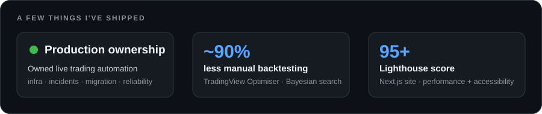
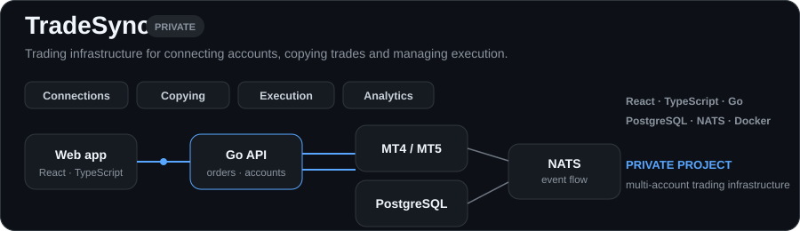

<table width="100%">
<tr>
<td width="132" align="center" valign="middle">
  
</td>
<td valign="middle">

# Patryk Broncel

**Computer Science · University of Sheffield**  
Full-stack software engineering · trading systems · ML & data

**Seeking a 2026/27 industrial placement**

[LinkedIn](https://linkedin.com/in/patrykbr) · [Email](mailto:patbroncel@gmail.com) · [Featured project](https://github.com/PatrykBr/Tradingview-Optimiser)

</td>
</tr>
</table>

  &nbsp;&nbsp;
  &nbsp;&nbsp;
  &nbsp;&nbsp;
  &nbsp;&nbsp;
  &nbsp;&nbsp;
  &nbsp;&nbsp;
  &nbsp;&nbsp;
  

<picture>
  <source media="(prefers-color-scheme: dark)" srcset="./assets/impact-dark.svg">
  <source media="(prefers-color-scheme: light)" srcset="./assets/impact-light.svg">
  
</picture>

## Selected work

<picture>
  <source media="(prefers-color-scheme: dark)" srcset="./assets/tradesync-compact-dark.svg">
  <source media="(prefers-color-scheme: light)" srcset="./assets/tradesync-compact-light.svg">
  
</picture>

 

<table width="100%">
<tr>
<td width="54%" valign="middle">
  
</td>
<td width="46%" valign="middle">

### [TradingView Strategy Optimiser ↗](https://github.com/PatrykBr/Tradingview-Optimiser)

Browser extension + local Python backend for automated strategy optimisation.

- **~90% less manual backtesting time**
- React / TypeScript extension + FastAPI backend
- Bayesian optimisation, walk-forward analysis and CI/CD

</td>
</tr>
</table>

## Background

<table width="100%">
<tr>
<td width="33%" valign="top">

**University of Sheffield**  
BSc Computer Science  
On track for First Class Honours

</td>
<td width="33%" valign="top">

**TradeAlgorithm**  
Product & Technical Associate  
Production trading automation + infrastructure

</td>
<td width="33%" valign="top">

**Dissertation**  
Synthetic data in financial settings  
Generation · augmentation · privacy · stress testing

</td>
</tr>
</table>

<strong>More projects & experience</strong>

 

- **Bespoke Broncel Furniture** — Next.js 15 + TypeScript site, 95+ Lighthouse, gallery, contact system, analytics and SEO.
- **AMRC Digital Thread Visualisation Tool** — Rails 8 team project for an external client; frontend, authorisation-aware UI, accessibility and requirements work.
- **Spring Boot + React application** — REST APIs and shared full-stack team development.
- **cTrader Webhook / Zed extensions / ShortForm Creator** — smaller public tools and experiments across automation and developer tooling.

