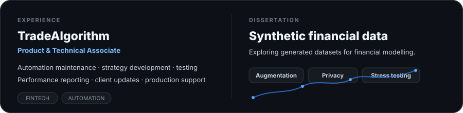

<picture>
  <source media="(prefers-color-scheme: dark)" srcset="./assets/hero-dark.svg">
  <source media="(prefers-color-scheme: light)" srcset="./assets/hero-light.svg">
  
</picture>

  <a href="https://linkedin.com/in/patrykbr"><strong>LinkedIn</strong></a>
  &nbsp;&nbsp;·&nbsp;&nbsp;
  <a href="mailto:patbroncel@gmail.com"><strong>Email</strong></a>
  &nbsp;&nbsp;·&nbsp;&nbsp;
  <a href="https://github.com/PatrykBr/Tradingview-Optimiser"><strong>TradingView Optimiser ↗</strong></a>

  &nbsp;&nbsp;
  &nbsp;&nbsp;
  &nbsp;&nbsp;
  &nbsp;&nbsp;
  &nbsp;&nbsp;
  &nbsp;&nbsp;
  &nbsp;&nbsp;
  &nbsp;&nbsp;
  &nbsp;&nbsp;
  

 

<picture>
  <source media="(prefers-color-scheme: dark)" srcset="./assets/tradesync-dark.svg">
  <source media="(prefers-color-scheme: light)" srcset="./assets/tradesync-light.svg">
  
</picture>

 

### TradingView Optimiser · [public project ↗](https://github.com/PatrykBr/Tradingview-Optimiser)

<table>
<tr>
<td width="68%" valign="middle">

</td>
<td width="32%" valign="middle">

**Browser extension + local optimisation backend**

- Chrome / Firefox
- React + TypeScript
- FastAPI + WebSockets
- Optuna Bayesian optimisation
- Walk-forward + Monte Carlo

</td>
</tr>
</table>

<table>
<tr>
<td width="33%" align="center"></td>
<td width="33%" align="center"></td>
<td width="33%" align="center"></td>
</tr>
</table>

 

<picture>
  <source media="(prefers-color-scheme: dark)" srcset="./assets/context-dark.svg">
  <source media="(prefers-color-scheme: light)" srcset="./assets/context-light.svg">
  
</picture>
