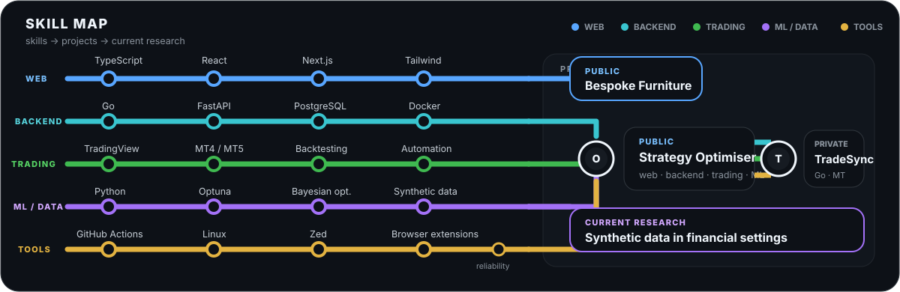
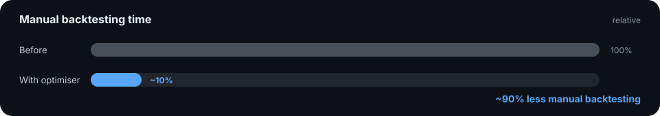

# Patryk Broncel

**BSc Computer Science · University of Sheffield**  
Full-stack software engineering · trading systems · applied ML/data

🚇 [Map](#skill-map) · 📈 [Optimiser](#-tradingview-strategy-optimiser--public) · 🔁 [TradeSync](#-tradesync-private) · 🪵 [Furniture](#-bespoke-broncel-furniture--public) · 🧱 [Experience](#experience)

## Skill map

◎ Interchanges are projects that use several routes at once.

  
  
  

<strong>🧰 More tools I've used</strong>

 

`Java` · `C#` · `Ruby` · `R` · `Rails` · `Spring Boot` · `Flask` · `Node.js` · `GitHub Actions`

## Selected work

### 📈 [TradingView Strategy Optimiser ↗](https://github.com/PatrykBr/Tradingview-Optimiser) `public`

Chrome extension + local Python backend for automated TradingView strategy optimisation.

  

  
  
  
  

  <picture>
    <source media="(prefers-color-scheme: dark)" srcset="./assets/backtesting-v1-dark.svg">
    <source media="(prefers-color-scheme: light)" srcset="./assets/backtesting-v1-light.svg">
    
  </picture>

<strong>🎛️ Open feature gallery + code quality</strong>

 

| Parameters | Running | Results |
| :---: | :---: | :---: |
|  |  |  |

  
  
  

### 🔁 TradeSync `private`

MT4/MT5 account connections · trade copying · order management · analytics

  
  
  
  

  &nbsp;&nbsp;
  &nbsp;&nbsp;
  &nbsp;&nbsp;
  &nbsp;&nbsp;
  

`Go API` · `PostgreSQL` · `NATS` · `Docker` · `MetaTrader bridges`

### 🪵 [Bespoke Broncel Furniture ↗](https://github.com/PatrykBr/bbf-site) `public`

Website for a bespoke furniture business, built with Next.js 15 and TypeScript.

  

  
  
  
  
  

## Experience

📊 **TradeAlgorithm** · Product & Technical Associate · Aug 2024 to Jul 2025  
`production automation` · `infrastructure` · `incident response` · `server migration`

🏭 **AMRC Digital Thread Visualisation Tool** · university team project  
`Rails 8` · `frontend` · `accessibility` · `authorisation` · `requirements`

<strong>🧰 Other things I've built</strong>

 

- [**cTrader Webhook**](https://github.com/PatrykBr/cTrader-Webhook) · trading automation tooling
- [**Zed StyLua**](https://github.com/PatrykBr/zed-stylua) / [**Zed Selene**](https://github.com/PatrykBr/zed-selene) · Zed extensions
- [**TradingView MCP**](https://github.com/PatrykBr/tradingview-mcp) · TradingView tooling
- [**Echo360 Speed Control**](https://github.com/PatrykBr/echo360-speed-control) · browser tooling

